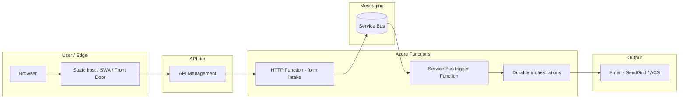

# Project: Azure Durable Functions demo — web form, Service Bus, IaC, GitHub Actions

## 1. Goal

A demonstration app on Azure that showcases **Durable Functions** (orchestrations), **decoupling** via **Azure Service Bus**, a **React** web tier, a public entry through an **API gateway**, and **infrastructure as code** with **automated build and deploy** from GitHub Actions.

---

## 2. “Lambda” and “CloudFront” equivalents in Azure

| Concept (AWS / generic) | Azure equivalent (for this project) |
|-------------------------|-------------------------------------|
| Lambda (serverless functions) | **Azure Functions** (Consumption or Flex Consumption plan) |
| API Gateway | **Azure API Management (APIM)** — single REST entry, policies, versioning |
| CloudFront (CDN in front of static content) | **Azure Front Door** + **Azure Storage (static website)** **or** **Azure Static Web Apps** (built-in CDN, simpler for SPAs) |

**PoC recommendation:** **Azure Static Web Apps** for React (CDN + HTTPS + custom domain are straightforward) **or** Storage static website + **Azure CDN / Front Door** if you want finer control at the network edge. APIM sits in front of **HTTP-triggered** Functions (or a single “facade” Function), not in front of the static host itself.

---

## 3. Functional requirements

### 3.1 Form (React)

Four fields:

| Field | Type |
|-------|------|
| Name | text |
| Email | email |
| Phone | phone |
| Choice | radio: **Azure** \| **M365** |

### 3.2 Submit behavior (logical)

1. The frontend **does not** call Durable orchestrations directly. It sends data to the **backend API** (via APIM).
2. The backend (one **HTTP-triggered Function** or a minimal endpoint) **validates** input and publishes a **message to the correct Service Bus queue** (or subscription) for **Azure** vs **M365** — see §4 and §5.
3. A **separate** Function (trigger: **Service Bus**) starts a **Durable orchestration** (or two different orchestrations depending on “Azure” / “M365” — see §4).
4. For now: **one activity per flow** inside the orchestration; steps will be extended later.
5. When the flow **completes**: send an **email** via a **transactional provider** (**SendGrid** or **Azure Communication Services**) for **both** radio options; the “Azure” / “M365” choice only affects which Durable path runs, not the mail provider.

The form is thereby **decoupled** from long-running work and from email: it only initiates asynchronous work through a queue.

---

## 4. Proposed architecture (logical flow)



**Two flows:** Implementation options:

- **Option A:** One queue/topic; the message includes `product: Azure | M365`; a single orchestrator branches logic.
- **Option B:** Two separate queues or topic subscriptions — one trigger for “Azure” and one for “M365”, each starting its own orchestration.

For a demo, **Option B** is often clearer; **Option A** uses fewer resources.

**Chosen:** **Option B** — two separate queues (or two topic subscriptions) and two `ServiceBusTrigger` functions (one for “Azure”, one for “M365”).

---

## 5. Azure Service Bus — “events” and decoupling

- **Service Bus queues** — one message is processed by one consumer; good for a task queue.
- **Service Bus topics + subscriptions** — one publisher, many subscribers (“event-like” within Service Bus).

Both **Event Grid** and **Service Bus** are valid for async patterns; your requirement explicitly names **Service Bus**, so the Functions trigger is **`ServiceBusTrigger`**, not Event Grid.

---

## 6. Infrastructure as code (IaC)

**Recommendation for an all-Azure stack:** **Bicep** (or **Terraform** if your org standardizes on it).

Minimum resource set in templates:

| Resource | Role |
|----------|------|
| Resource group | container |
| Storage account | Functions + (if needed) static assets |
| Function App + plan | Durable + HTTP + Service Bus triggers |
| Service Bus namespace | **two queues** (or topic + two subscriptions) for Azure vs M365 |
| API Management | gateway |
| **Azure Static Web Apps** | React (confirmed for this demo) |
| (optional) Key Vault | secrets (connection strings, SendGrid key) |
| Application Insights | observability |

Parameters: **single demo** environment, names, APIM SKU.

---

## 7. GitHub Actions — build and deploy

- **Triggers:** `push` to `main` / `release` tags (per your policy).
- **Steps (conceptual):**
  1. Checkout, setup Node (version pinned in `.nvmrc` or `package.json` engines).
  2. `npm ci` / `npm run build` for React.
  3. Build Functions (**Node.js / TypeScript** with Durable Functions extension).
  4. Deploy infrastructure: `az deployment` with Bicep **or** Terraform apply with remote state (Storage).
  5. Deploy Function App (zip deploy / `func azure functionapp publish` / Oryx).
  6. Deploy static assets (SWA GitHub Action **or** upload to Storage + CDN purge).

**GitHub secrets:** `AZURE_CLIENT_ID`, `AZURE_TENANT_ID`, `AZURE_SUBSCRIPTION_ID`, `AZURE_CLIENT_SECRET` (service principal), plus `AZURE_RESOURCE_GROUP` and others — not in the repo. Alternative: single JSON `AZURE_CREDENTIALS` if you configure `azure/login` with `creds:` instead.

---

## 8. Risks and constraints (brief)

- **APIM cold start / cost** — for a PoC use a lower SKU or temporarily call the Function over HTTPS directly (dev only), then add APIM.
- **Durable + Service Bus** — idempotency on message retries (optional duplicate detection in Service Bus).
- **Email** — transactional provider (**SendGrid** or **Azure Communication Services**); API keys in Key Vault / pipeline secrets.

---

## 9. Implementation phases

| Phase | Content |
|-------|---------|
| 1 | Repo: React form + one HTTP Function + Service Bus publish + Service Bus trigger + minimal Durable orchestration + one email at the end |
| 2 | Bicep for all resources + GitHub Actions |
| 3 | APIM in front of HTTP Function + policies |
| 4 | Richer orchestration steps, observability and security hardening |

---

## 10. Decisions (confirmed)

| Topic | Choice |
|-------|--------|
| **Functions runtime** | **Node.js / TypeScript** (Durable Functions) |
| **Email** | **Transactional** (**SendGrid** or **Azure Communication Services**) for **both** “Azure” and “M365” form options |
| **Static frontend** | **Azure Static Web Apps** |
| **Service Bus shape** | **Two** queues or **two** topic subscriptions — separate triggers per product path |
| **Environments** | **Single demo** — one resource group (prod-like for the PoC) |

---

## 11. IaC layout (Bicep)

Implemented layout for **one** demo environment (consolidated template; can be split into modules later):

```
infra/
  bicep/
    main.bicep                 # Service Bus, Function App, SWA, Log Analytics, App Insights, optional APIM
    parameters/
      demo.bicepparam          # Bicep parameter file (using)
      demo.parameters.json     # JSON parameters (CLI / Actions)
```

- **`main.bicep`** wires dependencies and exposes **outputs** (function app name, SWA hostname, optional APIM URLs) for GitHub Actions.
- **Secrets** are not committed: set SendGrid and other keys on the Function App after deploy, or use Key Vault + pipeline parameters.
- **CI:** `az deployment group create` with `main.bicep` + `parameters/demo.parameters.json`.

The same structure can map to **Terraform** (`infra/terraform/modules/...`, `environments/demo/terraform.tfvars`) if you standardize on Terraform instead of Bicep.

---

*This document is the baseline for scoping, implementation, and later extension of the demo.*
