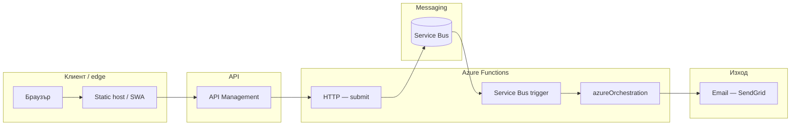
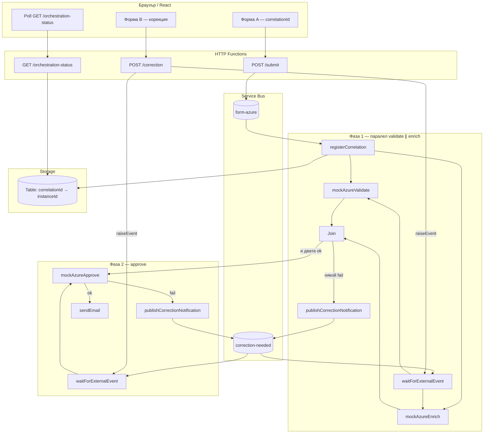
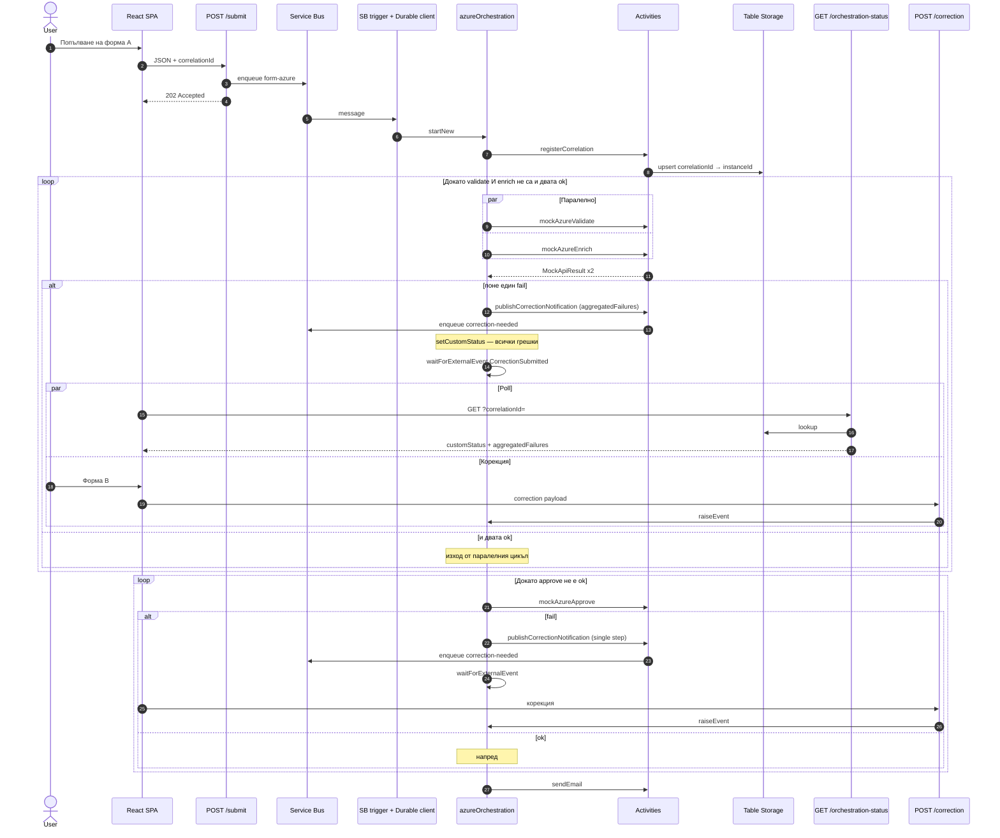

# Azure product path — `azureOrchestration`

Оркестрацията **`azureOrchestration`** използва **паралелни** стъпки **validate** и **enrich** (`context.df.Task.all`), **join** с обединени грешки и **една** корекция към уеб приложението при неуспех. След успешен join следва **последователна** стъпка **approve** (собствен цикъл за корекция при нужда).

## Кога фейлват стъпките (mock — отделни activities)

Всяка стъпка е **отделна** Azure Function activity: `mockAzureValidate`, `mockAzureEnrich`, `mockAzureApprove` (файлове в `functions/src/activities/`). Проверките са **демонстрационни**; съобщенията за грешка са фиксирани низове в кода.

| Стъпка | Условие за fail | Примерно съобщение към клиента |
|--------|-----------------|--------------------------------|
| **validate** | `name` след `trim` е по-къс от **2 символа** | `[Azure] Name too short (mock ARM validation)` |
| **enrich** | В `name` (без значение от главни/малки букви) се съдържа поднизът **`BLOCK`** | `[Azure] Enrichment blocked — policy on display name (mock)` |
| **approve** | `correctionConfirmed` е **false** или липсва (първоначалното submit го праща като `false`) | `[Azure] Risk gate: human confirmation required before provisioning (mock)` |

**Бележки:** Ако в паралелната фаза **и двете** стъпки fail-нат, UI получава **две** грешки наведнъж (`aggregatedFailures`). За да мине **approve**, потребителят трябва да изпрати корекция с **`correctionConfirmed: true`** (в SPA това е формата за корекция).

## End-to-end (логически)

## Детайл: Durable — паралел validate ∥ enrich, join, approve

Две фази с различни корекционни цикли (събитието е едно и също: `CorrectionSubmitted`).

При паралелен fail **`aggregatedFailures`** в custom status и в Service Bus. При fail на approve — единичен **`failedStep: approve`** и **`phase: singleStep`**.

## Sequence: паралелна фаза и корекция

## Уеб тир (форма vs монитор)

Корекциите и polling-ът към **`/orchestration-status`** са в **формата** SPA. Отделно **второ** Static Web App хоства само таблицата с инстанции (`/api/orchestration-monitor`) — различен публичен URL. Подробности: **[web-apps.md](web-apps.md)**.
