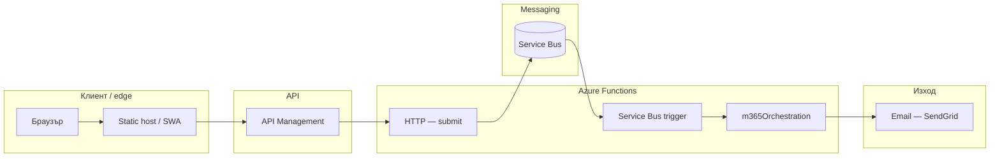
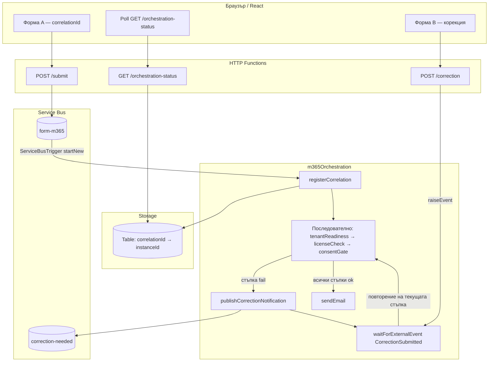
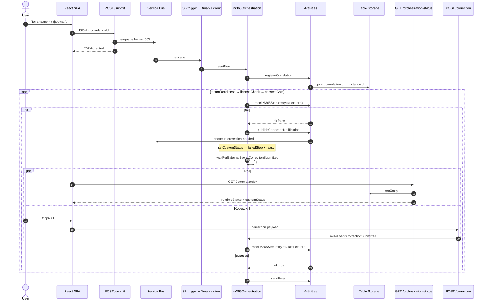

# Microsoft 365 product path — `m365Orchestration`

Оркестрацията **`m365Orchestration`** изпълнява стъпките **последователно**: `tenantReadiness` → `licenseCheck` → `consentGate` (activity **`mockM365Step`**). При неуспех на стъпка се изпраща известие към опашката **`correction-needed`**, UI ползва **`GET /orchestration-status`** и **`POST /correction`** със същия `correlationId`.

## End-to-end (логически)

## Детайл: Durable — последователни стъпки

При fail на дадена стъпка оркестраторът изчаква корекция и **извиква отново същата** `mockM365Step` със същото `stepName`, след което при успех продължава към следващата стъпка в веригата.

## Sequence: последователни стъпки и корекция

